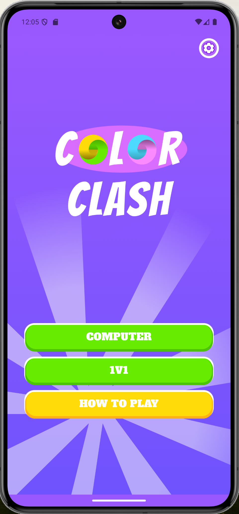
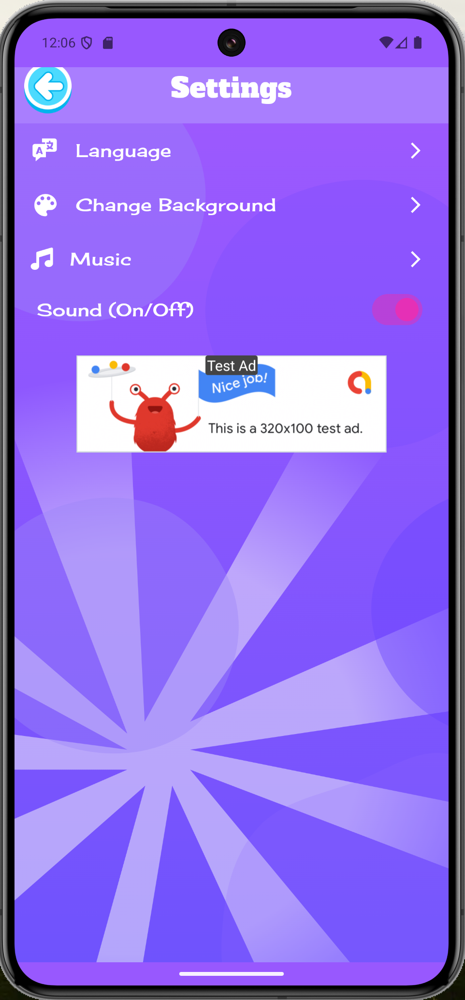
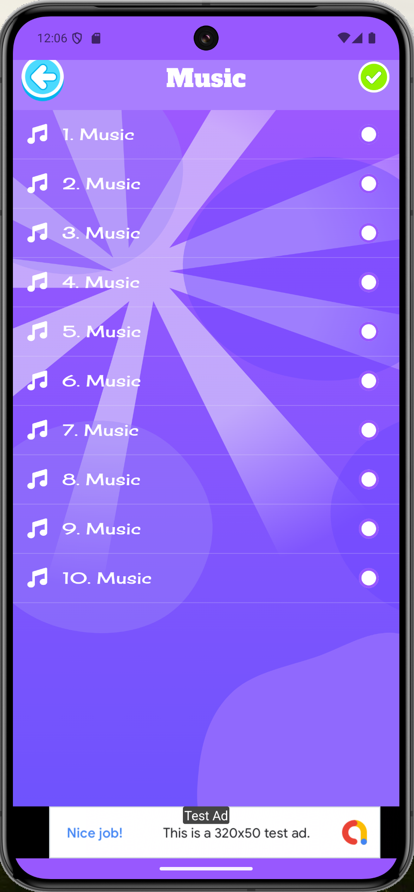
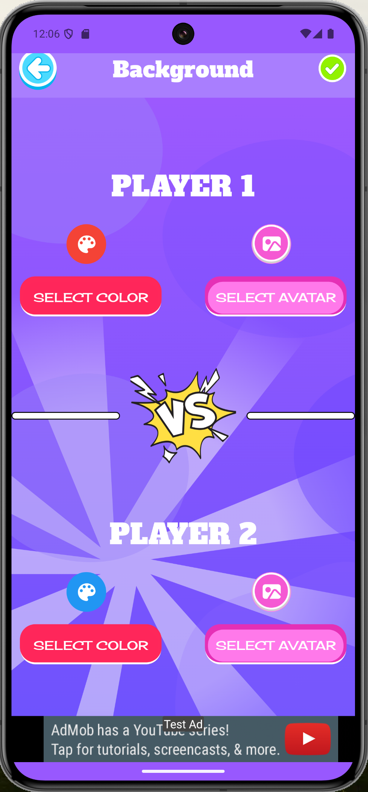
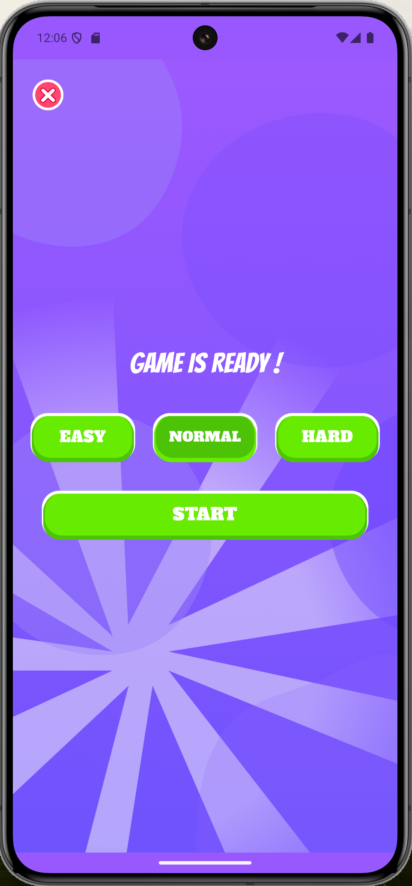
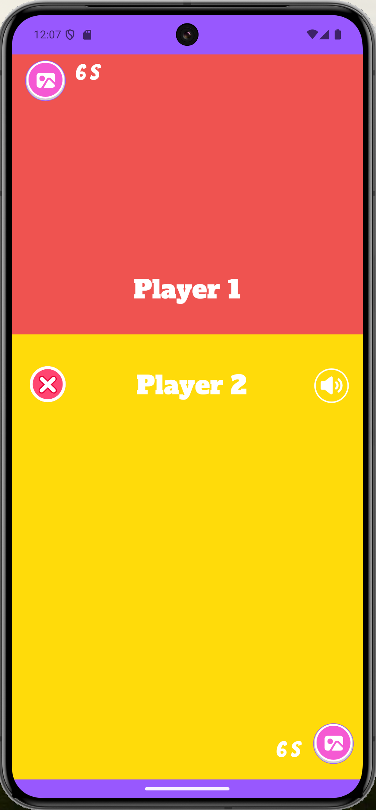
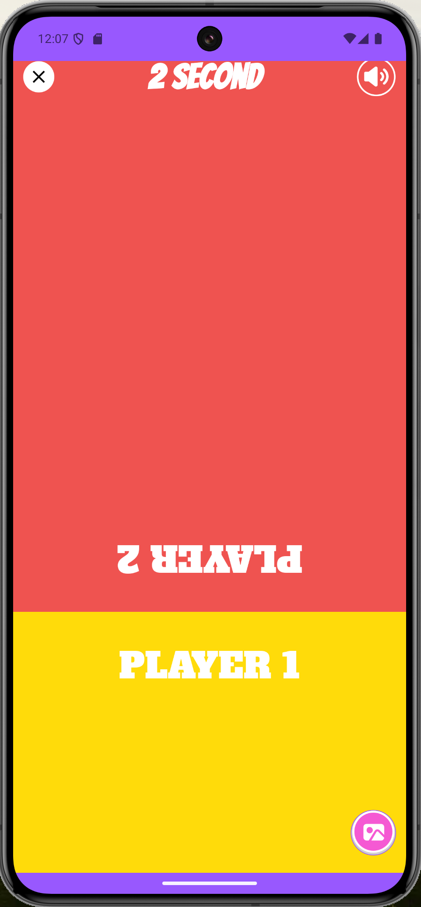
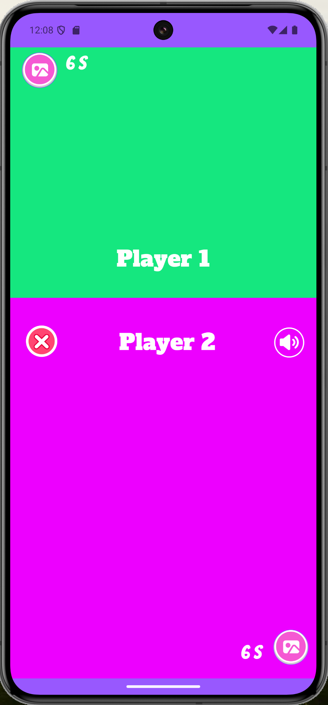

# Color Clash

Welcome to **Color Clash** – Embark on a vibrant journey of competition where victory hinges on your ability to click faster and expand your color space! Set the rhythm with music of your choosing and infuse your gameplay with a burst of personality by customizing avatars and colors. The quest for triumph intensifies as you strive to outpace opponents in a high-speed clicking frenzy. Feel the adrenaline whether challenging the computer solo or engaging in thrilling face-offs against friends. This game is not just about speed; it's a personalized and electrifying adventure where every click propels you closer to the sweet taste of victory.

<div style="display: flex; justify-content: space-around;">
   
   
   
   
   
   
   
   
</div>

## Installation

1. Clone the repository:
   ```bash
   git clone https://github.com/mgy-programmer/colorclash.git

2. Navigate into the project directory:
   ```bash
   cd colorclash

Contact
For any questions or feedback, feel free to reach out to us at contact@ayotechcorp.com

Enjoy playing and testing your trivia knowledge with Game Color Clash!
   


